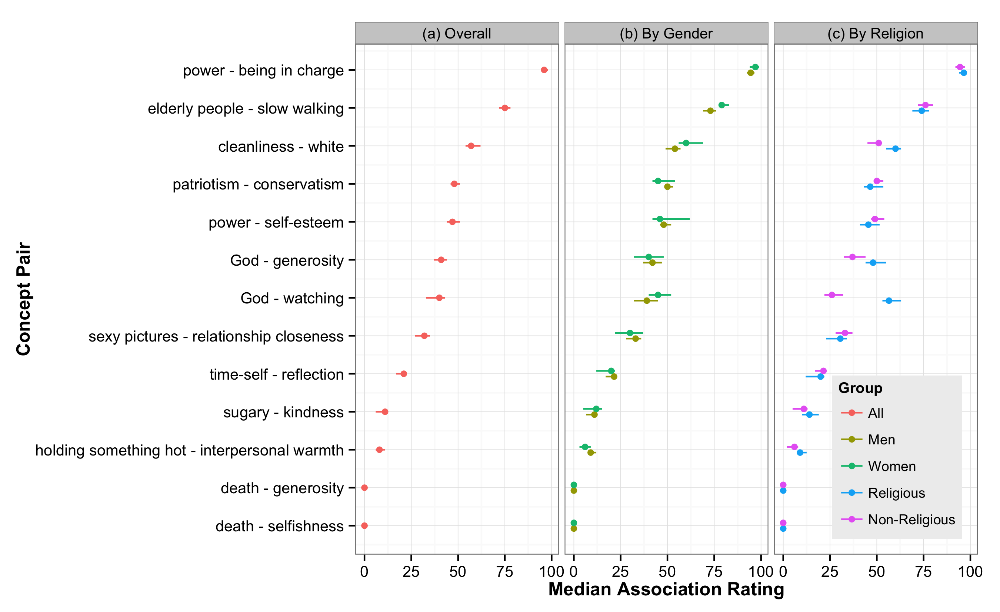

# Summary Plotting

This repository contains data and R code for producing two types of plots.

The first plots individual responses to several items against a summary of
those responses.

In this example, the individual responses are from unique participants in a
single study, each providing a response for each of thirteen items in a survey
(gray diamonds). The summary is the mean and standard deviation of these
responses for each item (blue dots and error bars). However, the thirteen items
could just as easily be dependent variables from thirteen different studies in a
meta-analysis (with each participant's response + a summary for each study) or
from thirteen different effects in a Many Labs-style replication effort (with
gray diamonds representing each lab's effect size contribution for each effect,
and the blue summaries representing meta-analytic estimates for each effect).

The second plot presents only summary information for the same items but breaks
it down by two different moderators (in this example gender and religion).

Again, the individual items could easily be different studies in a meta-analysis
or different effects in a Many Labs style project.

The purpose of this repository is to provide code for producing these plots that
can be customized to the specific data set you have. I've included some data
from the preliminary work for my dissertation to help in reproducing the plots
and practicing some tweaks. But this was put together quickly, so please open
an issue or email me at ecsalomon@gmail.com if you have any questions or want
help using the code.

You can download the whole repository, including R code and data, by clicking on
"download ZIP" above the file list.
